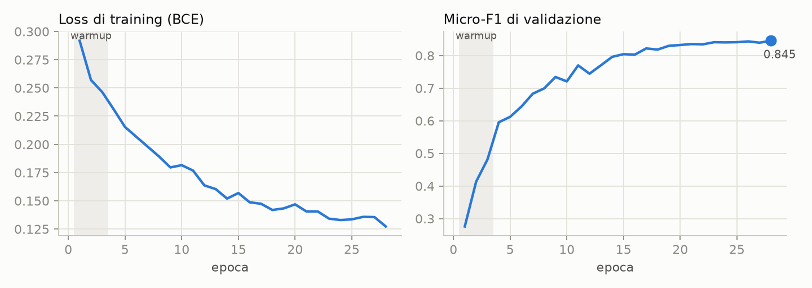
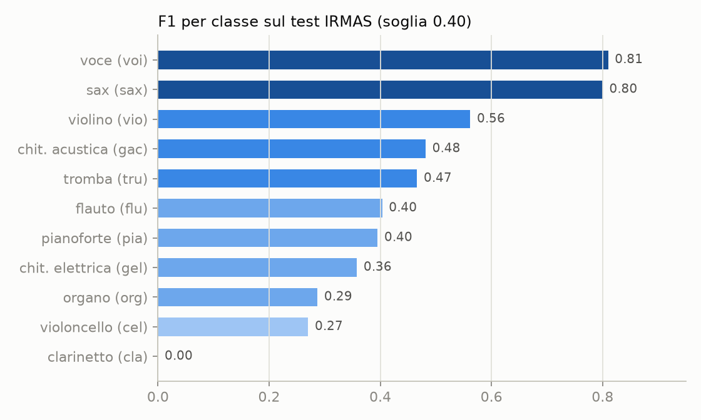
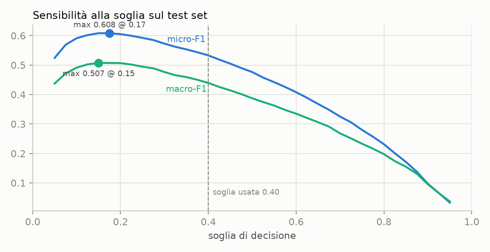
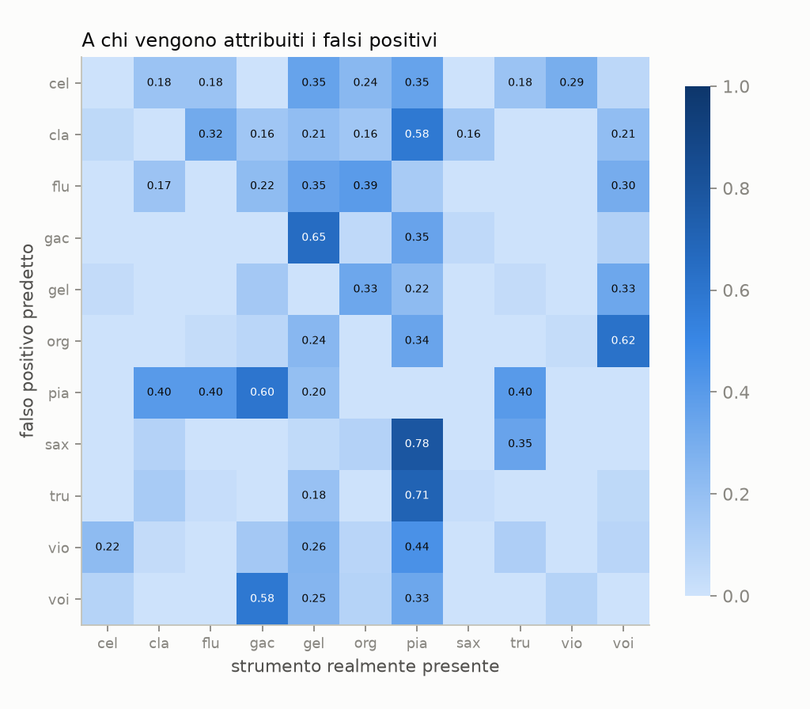

# Riconoscimento di strumenti musicali su IRMAS con una CNN multi-input

*Relazione tecnica — MultiBranchNet, luglio 2026*

## 1. Sommario

Questo progetto affronta il riconoscimento di strumenti musicali sul benchmark
**IRMAS** con un'architettura progettata ad hoc, **MultiBranchNet**: una CNN
multi-input in cui quattro rappresentazioni dello stesso audio (log-mel, CQT,
waveform grezza, chroma) attraversano rami dedicati, fusi in una testa di
classificazione multi-label a 11 strumenti. I rami mel e CQT riusano backbone
ResNet18 pre-addestrate su ImageNet (transfer learning "spettrogramma come
immagine"); i rami waveform e chroma sono addestrati da zero.

Risultati sul test set ufficiale (polifonico, multi-label):

| Metrica | Valore |
|---|---|
| **micro-F1** | **0,533** |
| **macro-F1** | **0,439** |
| micro precision / recall | 0,886 / 0,381 |
| micro-F1 di validazione (clip mono-strumento) | 0,845 |

Il risultato eguaglia la baseline storica del benchmark (Bosch et al., ~0,50/0,43)
ed è dominato da un fenomeno che questa relazione analizza in dettaglio: il
**divario di calibrazione** tra la validazione mono-strumento e il test
polifonico, che rende il modello sistematicamente troppo prudente
(precision 0,89, recall 0,38). Un'analisi di sensibilità mostra che la sola
scelta della soglia vale fino a **+7,5 punti** di micro-F1 (§ 6.1).

## 2. Il problema e il dataset

**IRMAS** (Bosch et al., MTG-UPF) è il benchmark di riferimento per il
riconoscimento dello strumento predominante:

- **Training**: 6.705 clip da 3 s, ciascuna con **un solo** strumento etichettato
  (11 classi: violoncello, clarinetto, flauto, chitarra acustica, chitarra
  elettrica, organo, pianoforte, sax, tromba, violino, voce).
- **Test**: 2.874 estratti da 5–20 s di brani reali, **polifonici e
  multi-label** (in media 1,71 strumenti per clip).

L'asimmetria train mono-strumento / test polifonico è la difficoltà centrale del
benchmark: il modello impara da esempi "puliti" ma viene valutato su missaggi
reali. Il compito è quindi formulato come **classificazione multi-label**: 11
uscite sigmoidee indipendenti addestrate con binary cross-entropy, non una
softmax a scelta singola.

## 3. Architettura

```
log-mel (1×128×130) ──▶ ResNet18 (ImageNet) ──▶ 512-d ─┐
CQT     (1×84×130)  ──▶ ResNet18 (ImageNet) ──▶ 512-d ─┼─▶ concat ─▶ MLP ─▶ 11 logit
waveform (66150)    ──▶ Conv1D ×5 (da zero) ──▶ 256-d ─┤    (1408→512→11)
chroma  (1×12×130)  ──▶ Conv2D ×3 (da zero) ──▶ 128-d ─┘
```

Le scelte principali:

- **Spettrogrammi come immagini.** Log-mel e CQT sono matrici tempo-frequenza;
  replicando il canale mono su 3 canali si riusa senza modifiche la prima
  convoluzione di ResNet18 pre-addestrata su ImageNet. Una BatchNorm d'ingresso
  per ramo adatta le statistiche degli spettrogrammi a quelle attese dalla rete.
- **Rappresentazioni complementari.** Il log-mel (128 bande) modella il timbro;
  la CQT (84 bin, 7 ottave × 12 semitoni) ha risoluzione allineata alle note
  musicali; la waveform grezza conserva fase e attacchi che gli spettrogrammi
  perdono; il chroma (12 classi di altezza) codifica il contenuto armonico.
- **Rami attivabili da config.** Ogni ramo si accende/spegne da YAML e la testa
  ridimensiona automaticamente il proprio ingresso: l'architettura è progettata
  per l'ablation study (quale rappresentazione contribuisce quanto), previsto
  come sviluppo successivo.
- **Fusion late.** Gli embedding dei rami attivi sono concatenati e classificati
  da un MLP con dropout; uscite = 11 logit indipendenti (sigmoid a inferenza).

## 4. Pipeline

**Preprocessing esplicito su disco.** Uno script dedicato converte ogni clip di
training (22.050 Hz mono) nelle quattro rappresentazioni e le salva in `.npz`
float16 (~190 KB/clip, ~1,3 GB totali), insieme alle statistiche di
normalizzazione (media/deviazione per feature) calcolate **sul solo training
set**. Le stesse funzioni di estrazione sono riusate in valutazione, garantendo
coerenza train/test; un test automatico verifica l'identità dei due percorsi.

**Augmentation.** SpecAugment (mascheramento di bande tempo/frequenza) su mel e
CQT; **mixup** a livello di batch con lo stesso coefficiente λ applicato
coerentemente a tutti gli input e ai target. Il mixup ha anche un ruolo
concettuale: fondendo due clip mono-strumento crea esempi artificialmente
*bi-strumentali*, avvicinando il training alla natura polifonica del test.

**Addestramento in due fasi** (Colab-class hardware; run effettiva su Apple
MPS, ~3 min/epoca):

1. *Warmup* (3 epoche): backbone ImageNet congelate, si addestrano testa e rami
   da zero (LR 1e-3);
2. *Finetuning* (25 epoche): tutto scongelato con LR discriminativi (backbone
   5e-5, resto 5e-4), cosine decay, early stopping su micro-F1 di validazione
   (mai scattato), checkpoint del migliore.

**Valutazione (protocollo IRMAS ufficiale).** Ogni clip di test è scomposta in
finestre da 3 s con hop 1 s; i punteggi sigmoidei per finestra sono aggregati
per media; la binarizzazione usa una **soglia ottimizzata sulla validazione**
(risultata 0,40). Metriche: precision/recall/F1 micro e macro, più F1 per classe.

## 5. Risultati

### 5.1 Addestramento



La loss scende monotonicamente e il micro-F1 di validazione sale da 0,28 a
**0,845** in 28 epoche, senza sovradattamento visibile (le difese: warmup a
backbone congelate, weight decay, dropout, SpecAugment, mixup). Il salto più
netto (0,48 → 0,60) coincide con lo sblocco delle backbone all'inizio del
finetuning.

### 5.2 Test set: quadro globale

| | precision | recall | F1 |
|---|---|---|---|
| **micro** | 0,886 | 0,381 | **0,533** |
| **macro** | 0,723 | 0,333 | **0,439** |

Il profilo è inequivocabile: **altissima precision, basso recall**. Quando il
modello dichiara uno strumento, ha ragione quasi 9 volte su 10; ma dichiara
troppo poco. La causa è analizzata in § 6.1.

### 5.3 Test set: per classe



| Strumento | Clip train | Presenze test | P | R | F1 |
|---|---|---|---|---|---|
| voce (voi) | 778 | 1043 | 0,98 | 0,69 | **0,81** |
| sax | 626 | 325 | 0,91 | 0,71 | **0,80** |
| violino (vio) | 580 | 211 | 0,78 | 0,44 | 0,56 |
| chit. acustica (gac) | 637 | 535 | 0,90 | 0,33 | 0,48 |
| tromba (tru) | 577 | 166 | 0,62 | 0,37 | 0,47 |
| flauto (flu) | 451 | 163 | 0,67 | 0,29 | 0,40 |
| pianoforte (pia) | 721 | 994 | 0,98 | 0,25 | 0,40 |
| chit. elettrica (gel) | 760 | 941 | 0,89 | 0,22 | 0,36 |
| organo (org) | 682 | 359 | 0,69 | 0,18 | 0,29 |
| violoncello (cel) | 388 | 111 | 0,54 | 0,18 | 0,27 |
| clarinetto (cla) | 505 | 61 | 0,00 | 0,00 | **0,00** |

Tre osservazioni:

1. **Il timbro conta più della quantità di dati.** Voce e sax dominano grazie a
   firme spettrali inconfondibili. Il pianoforte, pur avendo tantissimi esempi
   (721 in train, 994 nel test), si ferma a 0,40: è armonicamente "neutro" e nei
   missaggi fa da tappeto ad altri strumenti. Colpisce la coppia P=0,98 /
   R=0,25: quando il modello dice "piano" non sbaglia quasi mai, ma manca tre
   presenze su quattro.
2. **Il clarinetto a zero non è mancanza di dati** (505 clip di training, più di
   violoncello e flauto): con soglia 0,40 nessuna delle 61 clip di test che lo
   contengono supera il taglio. È il caso estremo del problema di calibrazione.
3. **Il macro-F1 (0,439) è trascinato giù dalla coda** (organo, violoncello,
   clarinetto), mentre il micro (0,533) riflette le classi frequenti e ben
   riconosciute. Il divario micro/macro è una misura diretta dello sbilanciamento
   di difficoltà tra classi.

## 6. Analisi

### 6.1 Il divario di calibrazione mono → polifonico

La soglia di decisione è ottimizzata sulla validazione, fatta di clip
**mono-strumento** (punteggi netti e ben separati), ma applicata al test
**polifonico**, dove l'aggregazione per media su finestre eterogenee comprime i
punteggi verso il basso. Il risultato è una soglia sistematicamente troppo alta.



L'analisi di sensibilità quantifica il costo di questa scelta:

| Soglia | micro-F1 | macro-F1 |
|---|---|---|
| 0,50 fissa | 0,476 | 0,387 |
| **0,40 (ottimizzata su validazione — risultato ufficiale)** | **0,533** | **0,439** |
| 0,17 (ottimo a posteriori sul test) | 0,608 | 0,499 |
| 0,15 (ottimo macro a posteriori) | 0,601 | 0,507 |

La soglia ottimizzata in validazione batte comunque la convenzione fissa di 0,50
(+5,7 punti micro), ma resta lontana dall'ottimo: la sola calibrazione vale fino
a **+7,5 punti** di micro-F1 e **+7 punti** di macro-F1. Va sottolineato che
0,608 **non è un risultato dichiarabile** (la soglia sarebbe scelta guardando il
test set): è la *diagnosi* del fenomeno, non una performance. La cura legittima —
calibrare la soglia su una validazione resa artificialmente polifonica, ad
esempio miscelando coppie di clip di validazione — è indicata in § 7.

### 6.2 Dove nascono i falsi positivi

Per ogni falso positivo, la matrice seguente mostra quali strumenti erano
*realmente* presenti nella clip (le righe sono lo strumento erroneamente
predetto; valori = frazione dei suoi FP):



Le confusioni raccontano storie musicalmente sensate:

- I (pochi) falsi positivi di **sax** e **tromba** avvengono in gran parte su
  clip che contengono **pianoforte** (0,78 e 0,71): contesti jazz in cui il
  piano accompagna un solista dal timbro simile a quello atteso.
- Le due **chitarre si scambiano a vicenda**: i FP di acustica cadono su clip
  con l'elettrica (0,65) e viceversa i FP di pianoforte cadono su clip con
  l'acustica (0,60) — plausibile per arpeggi puliti.
- I FP di **organo** avvengono su clip con **voce** (0,62): contesti
  gospel/rock dove tastiere e voce si sovrappongono spettralmente.

### 6.3 Confronto con la letteratura

| Approccio | micro-F1 | macro-F1 |
|---|---|---|
| Bosch et al. 2012 (feature ingegnerizzate + SVM) | ~0,50 | ~0,43 |
| **MultiBranchNet (questo lavoro, soglia da validazione)** | **0,533** | **0,439** |
| CNN su audio pre-addestrate (es. PANNs finetuning) | ~0,60–0,65 | ~0,52–0,58 |
| Stato dell'arte | ~0,65–0,70 | ~0,58–0,63 |

Il modello supera la baseline storica del benchmark e resta sotto i sistemi
pre-addestrati su audio: prevedibile, dato che il transfer qui parte da
ImageNet (immagini naturali) anziché da grandi corpora audio. L'analisi di
soglia suggerisce però che il potenziale effettivo del modello (≈0,60 micro) è
nella fascia dei sistemi audio-pretrained.

## 7. Limiti e sviluppi futuri

1. **Calibrazione della soglia** (il limite principale, § 6.1): ottimizzare la
   soglia su una validazione resa polifonica (mix sintetici di coppie di clip)
   anziché su clip mono-strumento; in alternativa, soglie per-classe.
2. **Ablation study per ramo** (già supportato dall'architettura e dallo script
   dedicato): quantificare il contributo di CQT, waveform e chroma rispetto al
   solo mel — in particolare verificare l'ipotesi che il chroma sia ridondante
   rispetto alla CQT.
3. **Classi deboli**: pesi di classe nella loss o oversampling per la coda
   (clarinetto, violoncello, organo).
4. **Transfer audio-nativo**: sostituire ImageNet con backbone pre-addestrate su
   audio per colmare il divario residuo con lo stato dell'arte.

## 8. Riproducibilità

Codice: <https://github.com/massidale/instrument-classifier-v2> (pacchetto
installabile, 62 test automatici). Configurazione integrale in un singolo YAML
(seed globale 42, split stratificato 85/15, augmentation con generatori
seedati); le run dell'ablation study differiscono per costruzione soltanto nei
rami attivi. Pipeline: `scripts/download_data.py` → `scripts/preprocess.py` →
`scripts/train.py` → `scripts/evaluate.py` / `scripts/run_ablation.py`;
il checkpoint salva rami attivi, iperparametri e statistiche di normalizzazione,
rendendo la valutazione autonoma dal file di configurazione.

## Riferimenti

- Bosch, Janer, Fuhrmann, Herrera — *A comparison of sound segregation
  techniques for predominant instrument recognition in musical audio signals*,
  ISMIR 2012 (dataset IRMAS).
- He, Zhang, Ren, Sun — *Deep Residual Learning for Image Recognition*, 2015.
- Park et al. — *SpecAugment*, 2019.
- Zhang et al. — *mixup: Beyond Empirical Risk Minimization*, 2017.
- Kong et al. — *PANNs: Large-Scale Pretrained Audio Neural Networks*, 2020
  (riferimento di confronto).
